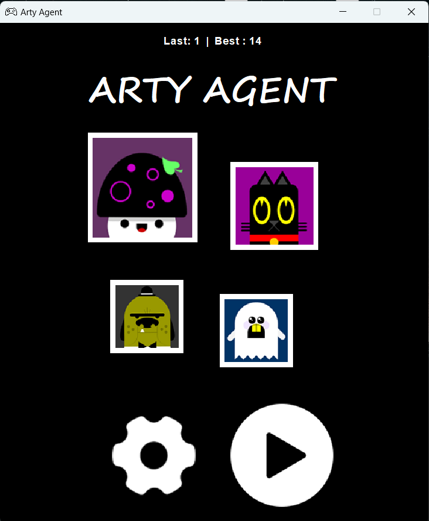
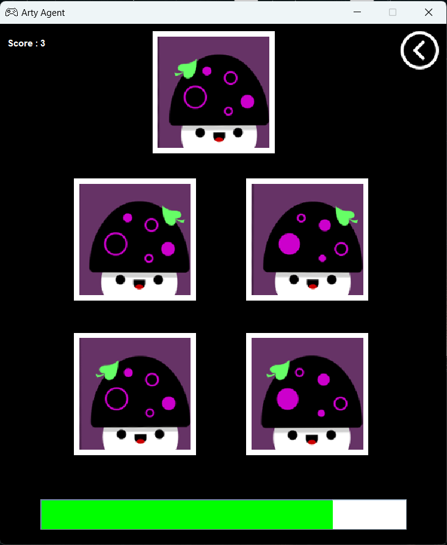

# Arty Agent

[Arty Agent](https://www.mathsisfun.com/games/ninja/arty/) is a game designed for a college project. Players must identify genuine artworks hidden within a selection of cleverly crafted forgeries.

## File Structure

- **classes:** Utility classes, data models.
- **frames:** Main game window and graphical user interface (GUI).
- **icons:** Graphic files used as icons throughout the game.
- **interfaces:** Interfaces defining blueprints for implementing design patterns.
- **panels:** Individual screens within the game interface.
- **pictures:** Image files for players to analyze and select.
- **sounds:** Audio files for background music and effects.
- **tests:** JUnit tests for checking design pattern implementations.

## Design Patterns

- **Singleton:** The Singleton design pattern is used when instantiating the HomePanel class. It ensures that only one instance of the HomePanel class can exist throughout the game.
- **Iterator:** The Iterator design pattern is utilized to scroll through the collection of pictures from which the player must search for a specific one. It allows sequential access to these pictures, presenting them one by one to the player.
- **Memento:** The Memento design pattern is used to store the player's score during gameplay. When the game ends, the player's score is saved in a settings.txt file, allowing the game to remember and display it later on the homepage (HomePanel).
- **State:** The State design pattern is employed to manage the game's state, distinguishing between playing and idle states.
- **Adapter:** The Adapter design pattern is used to play several audio formats when the player chooses the searched picture correctly or incorrectly. It provides flexibility and compatibility with multiple audio formats.

## Screenshots

